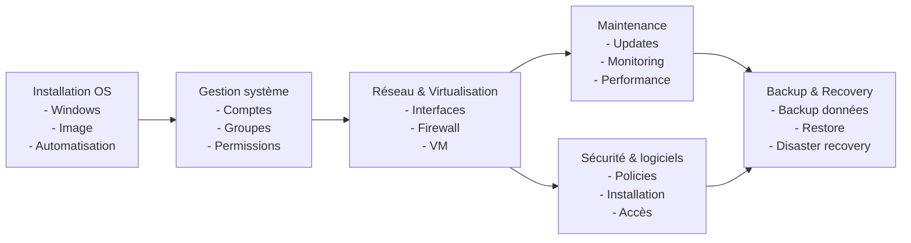

<<<<<<< HEAD
# Plan De Cours

[:tada: Participation](.scripts/Participation.md)

## :a: Github

:round_pushpin: Creer un compte sur [:octocat: Github](https://github.com)

- [ ] Explorer [Github Education](https://education.github.com)

:round_pushpin: Créer une page 

- [ ] créer un répertoire avec son :id: et ajouter le fichier `README.md`
- [ ] créer un répertoire dans son répertoire :id:, ajouter le répertoire `images` et ajouter le fichier `.gitkeep`
- [ ] Ajouter des images dans le répertoire `images`
- [ ] Ajouter les images au fichier `README.md`

---

# References
=======
# INF1092-201-E26-01 (Mardi 12H30 S208)
Introduction à l'administration des systèmes

<image src=image_0.jpg width='50%' height='50%' > </image>

## :date: [Épreuves](.epreuves)

| :hash:  | Date   | Épreuves                                           |
|-------- |--------|:---------------------------------------------------|

## 🧨 [Évaluations](.evaluations)

| :hash:  | Date   | Evaluations                                        |
|-------- |--------|:---------------------------------------------------|

## :one: [Devoirs](Devoirs)

|  :hash: | Date   | Cours                                  | 🎉 Participations                            |
|---------|--------|:---------------------------------------|:---------------------------------------------|
| :one:   | 11-Mai | [0.PlanDeCours](0.PlanDeCours)         | [🎉](0.PlanDeCours/.scripts/Participation.md) |
| :two:   | 19-Mai | [1.Programmation](0.PlanDeCours)         | [🎉](1.Programmation/1.IDE/.scripts/Participation.md) |

## 📜 Déroulement du cours

Le déroulement peut être modifié au besoin. La personne étudiante sera avisée.

#### ✅ Actuel

| Période | Activités/Thèmes |
|-|-|
| 11-Mai | [Présentation du **Plan De Cours**](0.PlanDeCours) 

#### 🟣 Affiché

| Smnes | Activités/Thèmes | Ressources/module |
|-:|-|-|
|  1️⃣  | 
|  2️⃣  | 
|  3️⃣  | 
|  4️⃣  | 
|  5️⃣  | 
|  6️⃣  | 
|  7️⃣  | 
|  8️⃣  | 
|  9️⃣  | 
| 1️⃣0️⃣ | 
| 1️⃣1️⃣ | 
| 1️⃣2️⃣ | 
| 1️⃣3️⃣ | 
| 1️⃣4️⃣ | Évaluation sommative                                                                         | Notes de cours en ligne |

# :books: References
>>>>>>> 96d6a47251df04e2c911b02091736681f13368f4
