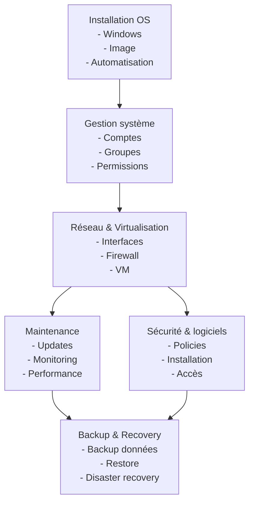

# Plan De Cours

[:tada: Participation](.scripts/Participation.md)

## :a: Github

:round_pushpin: Creer un compte sur [:octocat: Github](https://github.com)

- [ ] Explorer [Github Education](https://education.github.com)

:round_pushpin: Créer une page 

- [ ] créer un répertoire avec son :id: et ajouter le fichier `README.md`
- [ ] créer un répertoire dans son répertoire :id:, ajouter le répertoire `images` et ajouter le fichier `.gitkeep`
- [ ] Ajouter des images dans le répertoire `images`
- [ ] Ajouter les images au fichier `README.md`

---

# References
