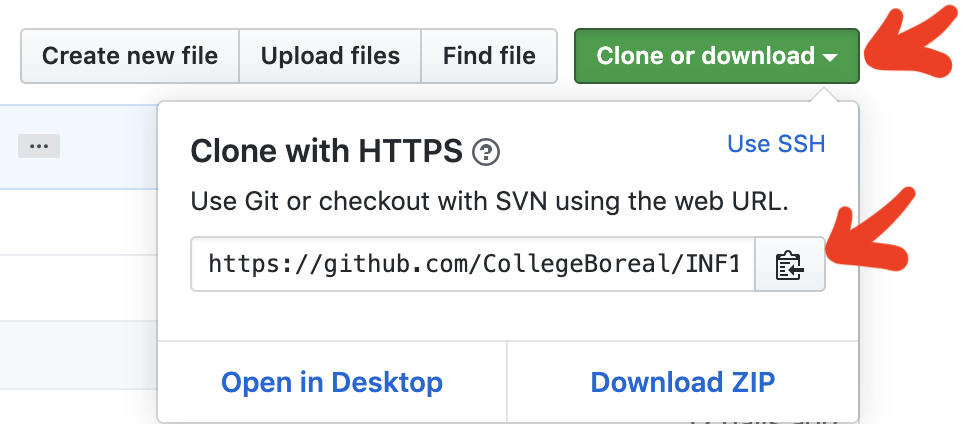

# IDE (Integrated Development Environment)

| SSH |
|-|
| [:1st_place_medal: Participation](.scripts/Participation.md) |

### :o: Installation

:point_right: Suivre l'[Installation](https://github.com/CollegeBoreal/Tutoriels/tree/main/0.GIT/Installation) 

### :one: Les premiers pas avec git

* Ouvrir une fenêtre de ligne de commande
* Creer un repertoire pour faire du développement (en anglais et avec `D` en majuscule)
```sh
mkdir Developer
```
* changer de repertoire pour faire du développement
```sh
cd Developer
```

* Cloner votre premier repertoire git

   - aller sur la page github du cours
   
   - cliquer sur le bouton `clone or download`
   
   - cliquer sur le `presse papier` pour mettre en mémoire l'URL du répertoire

   </image>

   - coller l'URL du répertoire en mémoire dans le presse papier avec RIGHT-CLICK/PASTE

   ```sh
   git clone https://github.com/CollegeBoreal/INF1092-201-E26-01.git
   ```
   
* allez dans le répertoire du cours

```sh
cd INF1092-201-E26-01/1.Programmation/1.IDE
```

### :two: Créer son répertoire dans `(1.IDE)`:

:checkered_flag: pas à pas,

* avec le nom de répertoire :id: (votre identifiant boreal)
```bash
mkdir 🆔
```
* dans votre répertoire ajouter le fichier `README.md`
```bash
cd 🆔
```
```bash
nano README.md
```

* remonter vers le répertoire de la leçon
```bash
cd ..
```


* mettre le répertoire en scene (add to stage)
```sh
git add 🆔
```
> Vérifier son status avec (doit etre :green_circle: vert)  
```sh
git status
```

### :three: Donner un commentaire aux fichiers à valider (commit)

- [ ]  :a: Configurer GIT `~/.gitconfig` - `Configuration d'informations personnelles`

:bulb: pour soumettre son travail vers `github.com`

* Changer l'éditeur par défaut de `vi` à `nano`

```sh
git config --global core.editor "nano"
```

* Editer son nom utilisateur `github` et son courriel

```sh
git config --global --edit
```

* Rajouter la section `[user]` et remplacer `MonNom` et `MonCourriel@me_remplacer.com` par le votre

```ini
[core]
        editor = nano

[user]
# Please adapt and uncomment the following lines:
        name = MonNom
        email = MonCourriel@me_remplacer.com
```

- [ ]  :b: Signer son travail avec un commentaire

```sh
git commit --message ":star: Mon premier commentaire"
```

### :u6307: Mettre à jour mon répertoire local (pull)
```sh
git pull --no-edit
```

## :ab: SSH

### :four: Gestion de votre clé SSH

- [ ] [Générer votre clé SSH][SSH_KEY]
   ```sh
   ssh-keygen -t ed25519 -C "your_email@example.com"
   ```
   - Éviter le 'pass phrase' en appuyant sur la touche `Enter`
   - renommer les fichiers par défaut qui se trouvent dans le répertoire `~/.ssh`

        - aller vers le répertoire `~/.ssh`
      ```sh
      cd ~/.ssh
      ```
        - renommer les fichiers
      ```sh
      mv id_ed25519 ma_cle.pk
      mv id_ed25519.pub ma_cle.pub
      ```

- [ ] [:secret: Configurer git avec votre clé personnelle][SSH_PRIVATE_KEY] [Documentation][SSH_GITHUB_ACCOUNT]

* le Fichier de configuration `SSH` ***~/.ssh/config***

:pushpin: Utilisation du port ssh par défaut :two::two:

- Éditer le fichier de configuration de `SSH`

   ```sh
   nano ~/.ssh/config
   ```

- Ajouter le contenu ci-dessous et ajuster le nom de fichier de votre clé publique.

   ```powershell
   Host github.com
       HostName github.com
       User git
       IdentityFile ~/.ssh/ma_cle.pk
   ```

### :five: ⚙️ Rajouter sa clé publique à github.com

⚠️ [Ajouter votre clé publique à votre compte github][SSH_KEY_ACCOUNT]


### :six: Changer l'URL du cours

1. **revenir au répertoire du cours**

   ```sh
   cd ~/Developer/INF1092-201-E26-01/1.Programmation/1.IDE
   ```

2. **Changer l’URL du dépôt distant**

   ```sh
   git remote set-url origin git@github.com:CollegeBoreal/INF1092-201-E26-01.git
   ```

3. **Vérifier la nouvelle configuration du dépôt distant**

   ```sh
   git remote --verbose
   ```

    🖥️ Ce qui affiche actuellement :

   ```lua
   origin  git@github.com:CollegeBoreal/INF1092-201-E26-01.git (fetch)
   origin  git@github.com:CollegeBoreal/INF1092-201-E26-01.git (push)
   ```

### 7️⃣ 🌩️ Envoyer au serveur github.com

```bash
git push
```

## :toolbox: IDE

- [ ] [:beer: HomeBrew Visual Studio Code](https://formulae.brew.sh/cask/visual-studio-code) sur :apple: Apple

```sh
brew install --cask visual-studio-code
```

- [ ] [:chocolate_bar: Chocolatey Visual Studio Code](https://community.chocolatey.org/packages/vscode) sur :window: Windows

```sh
choco install vscode
```

# :books: References

## :bulb: [Tutoriel sur GIT](https://github.com/CollegeBoreal/Tutoriels/tree/main/0.GIT)

<image src=images/SSH.gif width='50%' height='50%' />


[SSH_KEY]: https://docs.github.com/en/authentication/connecting-to-github-with-ssh/generating-a-new-ssh-key-and-adding-it-to-the-ssh-agent#generating-a-new-ssh-key
[SSH_KEY_ACCOUNT]: https://docs.github.com/en/authentication/connecting-to-github-with-ssh/adding-a-new-ssh-key-to-your-github-account#adding-a-new-ssh-key-to-your-account
[SSH_PRIVATE_KEY]: https://github.com/CollegeBoreal/Tutoriels/tree/main/0.GIT#secret-configurer-git-clé-personnelle-documentation
[SSH_GITHUB_ACCOUNT]: https://docs.github.com/en/free-pro-team@latest/github/authenticating-to-github/adding-a-new-ssh-key-to-your-github-account

